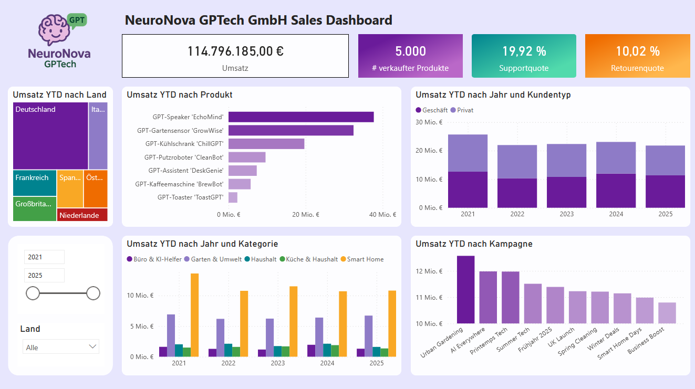

# chatGPTs-company-in-PowerBI
Power BI-Demo mit synthetisch generierten Verkaufsdaten eines fiktiven KI-Unternehmens („NeuroNova GPTech“). Enthält Produkte, Kunden, Umsätze (2021–2025), Zeitverläufe, Karten, YTD-Analysen, Farbschema &amp; Logo.


#  NeuroNova GPTech – Power BI Demo Report

Willkommen beim Power BI-Demoprojekt von **NeuroNova GPTech**, einem fiktiven KI-Unternehmen mit kreativen Produkten wie *ToastGPT*, *BrewBot* und *EchoMind*. Das Projekt zeigt, wie man synthetisch generierte Daten (via ChatGPT) in einem modernen Power BI Dashboard visualisieren kann.

---

##  Projektinhalt

- **5.000 Verkaufsdatensätze (2021–2025)**
- Produkt-, Kunden- und Umsatzdaten (B2B & B2C)
- Zeitintelligenz: YTD, Vorjahr, Monatsvergleiche
- Regionale Analysen (Länder, Regionen, Kartenvisualisierung)
- Kampagnenauswertung & Supportfälle
- ✨ Farbschema (JSON) + 🖼 Logo für Branding

---

## 📸 Vorschau

  


---

##  Dateien im Projektpaket

- 'NeuroNova GPTech Dashboard.pbix' - Reportdatei
- `produkte.csv` – Produktstammdaten  
- `kunden.csv` – Kundendaten mit Region & Typ (Privat/Geschäftlich)  
- `verkaeufe.csv` – Verkaufsdaten über mehrere Jahre  
- `neuronova_theme.json` – Power BI Farbschema  
- `NeuroNova_Logo.png` – Logo zur Verwendung im Bericht  

---

##  Power BI Einrichtung

### 1. Daten einbinden
- Öffne Power BI Desktop  
- Lade die CSV-Dateien über **Start > Daten abrufen > CSV**  

### 2. Datumstabelle nutzen
- Eine Datumstabelle (z. B. `Kalender`) muss vorhanden sein  
- Verknüpfe `Kalender[Datum]` mit `verkaeufe[Datum]`  
- Markiere die Tabelle als Datumstabelle über Rechtsklick  

### 3. Design importieren
- Gehe zu **Ansicht > Design > Importieren**  
- Wähle `neuronova_theme.json` als Farbschema  

---

## Beispielhafte DAX-Maße

```dax
Umsatz = SUMX(verkaeufe, verkaeufe[Menge] * RELATED(produkte[Preis (€)]))

Umsatz YTD = TOTALYTD([Umsatz], Kalender[Datum])

Umsatz Vorjahr = CALCULATE([Umsatz], SAMEPERIODLASTYEAR(Kalender[Datum]))

---

## 📄 License

This project is based on publicly available survey data. All visualizations and analyses were independently created. The rights to the raw data remain with Stack Overflow.  
This repository is licensed under the [MIT License](LICENSE).

---

## 🤝 Contact

For questions or feedback:  
**Markus Elstermann**  
📧 elstermannmarkus@gmail.com  
🔗 [LinkedIn](https://www.linkedin.com/)


